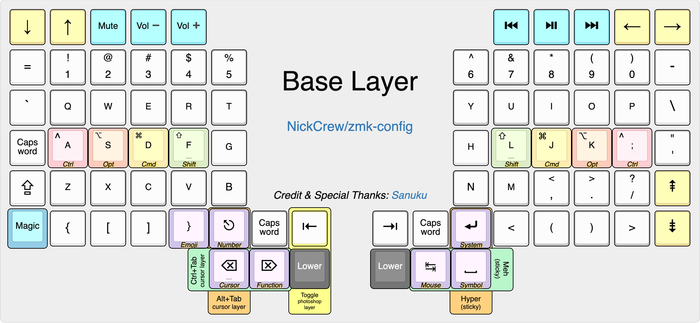
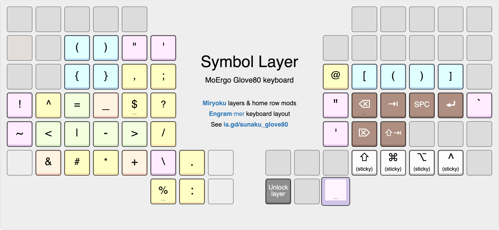
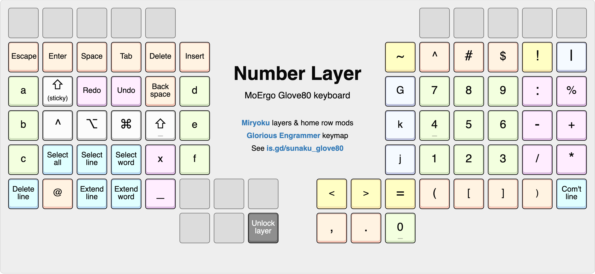
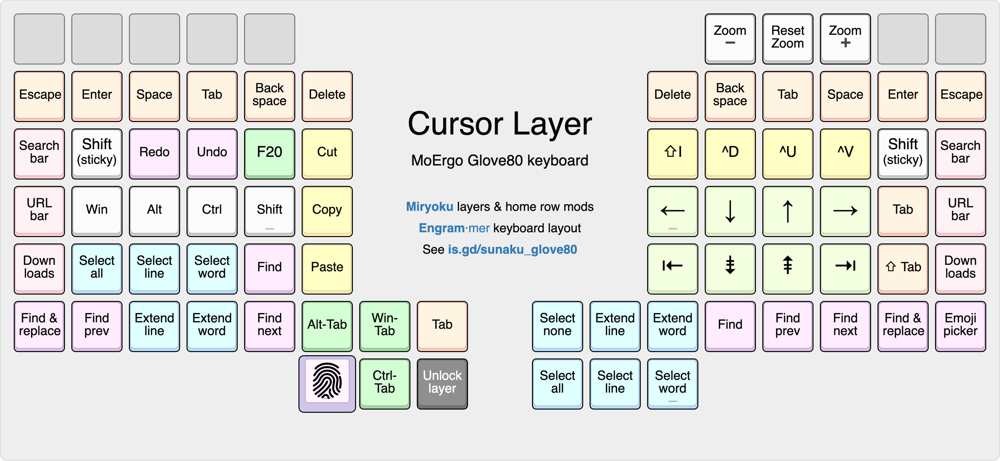
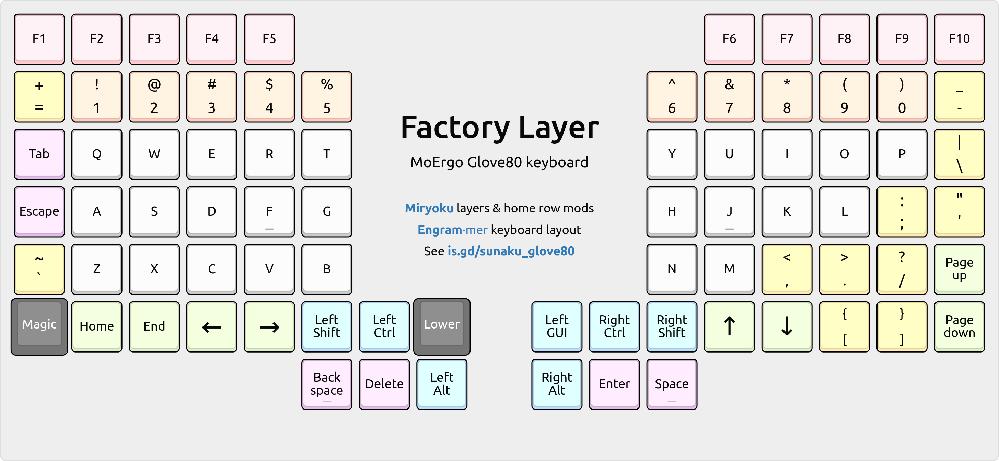
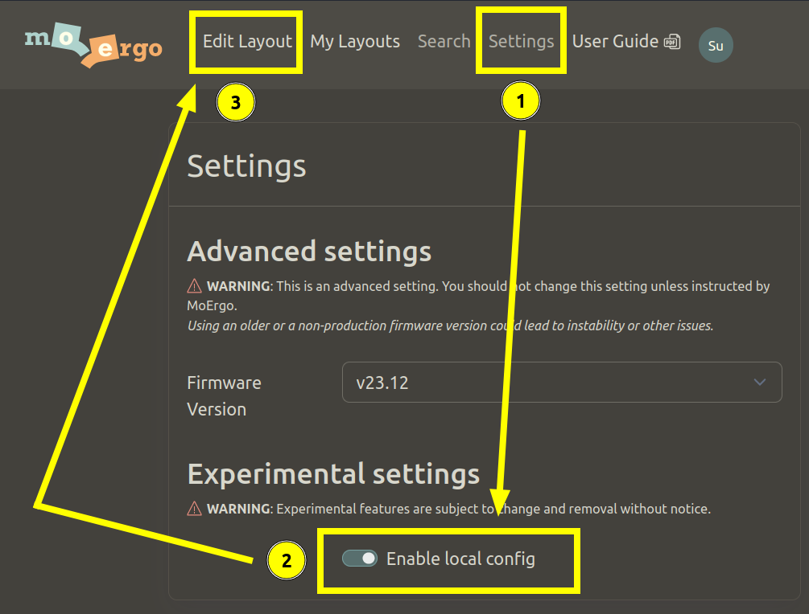
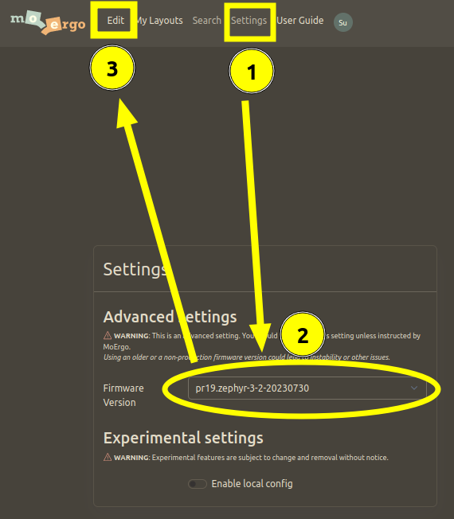
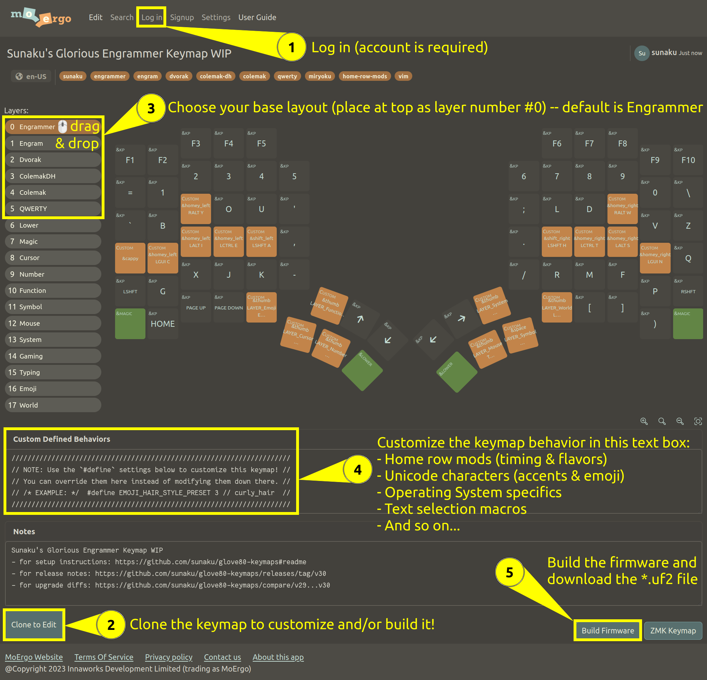
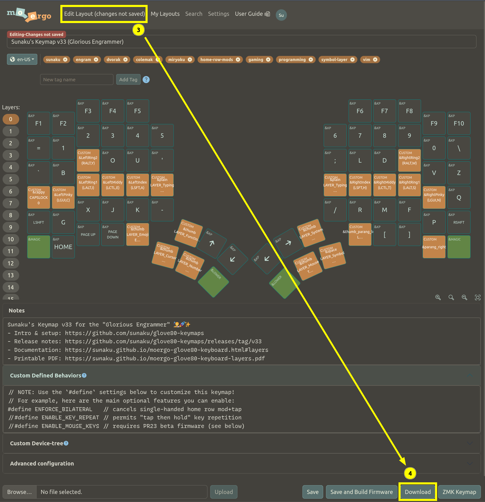

# MoErgo Glove80 Firmware and Keymap

This is my keymap for the [Glove80 keyboard][glove80]. 

Originally based on [Sanuku's Glove80 keymap][sanuku_glove80], featuring [home row mods](https://sunaku.github.io/home-row-mods.html) and enhanced [Miryoku layers][miryoku] (cursor, symbol, function, number, and more). 


[sanuku_glove80]: https://sunaku.github.io/moergo-glove80-keyboard.html
[glove80]: https://glove80.com
[miryoku]: https://github.com/manna-harbour/miryoku
[v38]: https://github.com/sunaku/glove80-keymaps/releases/v38


## Keymap

Version 38.1.3 (2024-12-29)
- Changes:
   - Customized emoji layer
- [Keymap][keymap]
- [Release notes][rel]

[rel]: https://github.com/NickCrew/glove80-keymaps/releases/tag/v38.1.3
[keymap]: https://my.glove80.com/#/layout/user/aa5fc6a3-e41b-43ca-abd1-af1d3917a6e6


Originally forked from [version 38][v38] of  [Sanuku's Glove80 keymap][sanuku_glove80]


## Contents

<!-- vim-markdown-toc GFM -->

* [Layers](#layers)
    * [Featured Layers](#featured-layers)
        * [Base layer](#base) 
        * [Symbol layer](#symbol) 
        * [Number layer](#number) 
        * [Cursor layer](#cursor) 
    * [Additional Layers](#additional-layers)
    * [Factory layer](#factory-layout)
* [Guide](#guide)
    * [Operating system](#operating-system)
    * [Home row mods](#home-row-mods)
        * [Difficulty level](#difficulty-level)
        * [Bilateral combinations](#bilateral-combinations)
    * [Layer access keys](#layer-access-keys)
    * [Emoji](#emoji)
        * [OS-native compose](#os-native-compose)
* [Installing](#installing)
    * [Enabling mouse emulation](#enabling-mouse-emulation)
    * [Flashing](#flashing)
* [Upgrading](#upgrading)
* [Customizing](#customizing)
    * [Overriding the defaults](#overriding-the-defaults)
        * [Reordering home row mods](#reordering-home-row-mods)
        * [Fine-tuning the timing](#fine-tuning-the-timing)
    * [Compiling from source](#compiling-from-source)
        * [Emoji characters](#emoji-characters)
            * [Adding a new Emoji character](#adding-a-new-emoji-character)
            * [Shift key for Emoji characters](#shift-key-for-emoji-characters)
        * [Editing layer map diagrams](#editing-layer-map-diagrams)
        * [Rearranging the base layer](#rearranging-the-base-layer)
            * [Mirroring horizontally](#mirroring-horizontally)
* [Discussion](#discussion)
* [License](#license)
* [Acknowledgements](#acknowledgements)

<!-- vim-markdown-toc -->

## Layers

[Printable diagram of all layers](./README/all-layers.pdf)

### Featured layers

#### Base



#### Symbol



#### Number



#### Cursor


 

### Additional layers

- [Mouse](./README/mouse.png) _- Mouse emulation (move, scroll, click, fwd/back buttons)_
- [Function](./README/function.png) _- F keys (F1-F20) and media controls)_
- [System](./README/system.png) _- Terminal, shell, and OS controls_
- [Emoji](./README/emoji.png) _- [Emojis](#emoji) (unicode input)_
- [Lower*](./README/lower.png) _- [Layer locking](#layer-access-keys)_
- [Typing](./README/typing.png) _- Disable home row mods_
- [Magic*](./README/magic.png) _- RGB, Bluetooth, and firmware_
- [Photoshop](./README/psmain.png) _- Photohshop shortcuts_
- [Photoshop Tools](./README/pstools.png) _- Photoshop tools_

> _* Layers included in the glove80's default configuration (with some modifications)_

### Factory layout



Before we get started, let's talk about your escape route back to familiarity.

If you're a new user (perhaps you've just unboxed your Glove80 or you haven't
customized its default keymap), you might find the Factory layer to be useful:

1. Press & hold the Magic key (bottom left corner key on left half of Glove80)
2. Tap the left hand's T3 key (furthest key on the upper arc of thumb cluster)

This shortcut will toggle the Factory layer on/off and allow you to experiment
with this keymap while maintaining an easy escape route to the factory default.
## Guide

Welcome to the *Glorious Wombat* keymap! 🧑‍🚀🚀✨  This introductory
guide will orient you to the world of custom layouts, keymaps, and firmware. 💁

## Guide

### Operating system

First, let's configure this keymap to better suit your operating system by
adding one of the following lines (just copy+paste whichever is appropriate)
atop the "Custom Defined Behaviors" text box in your clone of this keymap:

```h
#define OPERATING_SYSTEM 'L' // Linux
#define OPERATING_SYSTEM 'M' // macOS
#define OPERATING_SYSTEM 'W' // Windows
```

### Home row mods

Next, let's become familiar with the concept of [home row mods], which are
dual-function keys that *either* send normal keycodes (such as the letter `A`
or the number `1`) when tapped or modifiers (such as Shift or Ctrl) when held.


The diagram above shows the default "GACS" order of home row mods in this keymap:
- "G" means `LGUI`, which is the Win key in Windows, Cmd in macOS, Super in Linux.
- "A" means `LALT`, which is the Alt key in Windows and Linux, Option in macOS.
- "C" means `LCTL`, which is the Control key in Windows, macOS, and Linux alike.
- "S" means `LSFT`, which is the Shift key in Windows, macOS, and Linux alike.

**NOTE:** If you set your operating system to macOS in the preceding section,
the home row mods order will be automatically rearranged into "CAGS" because
macOS shortcuts tend to use the Cmd key like Windows/Linux use the Ctrl key.
However, you can inhibit the automatic rearrangement by adding this setting:
```h
#define MACOS_USE_GACS
```

#### Difficulty level

In order to help ease your transition to using [home row mods], this keymap
provides a difficulty level setting (like in a video game) that you can set:

```h
//
// DIFFICULTY_LEVEL specifies your level of expertise with this keymap.
// It's meant to help newcomers gradually work their way up to mastery.
//
#define DIFFICULTY_LEVEL 1 // novice (500ms)
#define DIFFICULTY_LEVEL 2 // slower (400ms)
#define DIFFICULTY_LEVEL 3 // normal (300ms)
#define DIFFICULTY_LEVEL 4 // faster (200ms)
#define DIFFICULTY_LEVEL 5 // expert (100ms)
//
// You can disable this setting by omitting it or assigning a `0` zero,
// in which case it will default to my personal set of time thresholds.
//
#define DIFFICULTY_LEVEL 0 // sunaku (150ms)
//
// No matter what difficulty level you choose, you can always override
// any settings in this keymap at the beginning of this configuration.
//
```

Unless you're already proficient in using home row mods, you might consider
choosing an appropriate difficulty level to match your current abilities and
gradually increase the difficulty level as you work your way up to mastery.

On the contrary, you can disable the difficulty level feature altogether by
removing the `#define DIFFICULTY_LEVEL` line or by setting its value to zero.
Then, you can experience the default values of all settings (representing my
personal fine-tuned configuration) or directly override them per your taste.


#### Bilateral combinations

In order to encourage proper touch-typing technique for shortcuts (where one
hand holds modifiers while the other taps keys to be modified) and for a more
natural typing experience that forgives [same-hand chords] and lingering holds,
this keymap provides bilateral combinations enforcement as an optional feature:

```h
//
// ENFORCE_BILATERAL cancels out single-handed home row mods activation by
// releasing any currently pressed mods and replacing them with plain taps.
//
// NOTE: You may still encounter "flashing mods" where an operating system
// action is triggered by the release of mods, such as LGUI which launches
// the Windows Start Menu and LALT which opens the Microsoft Office Ribbon.
//
#define ENFORCE_BILATERAL
```

Why not just use one-handed shortcuts?  I visualize it this way: I'm trying to
reach a cookie jar that is high up on a kitchen shelf, so I place one hand on
the kitchen counter (the modifier-holding hand) to stabilize myself while I
reach up for the jar with my other hand (the modified-key tapping hand). 🙋✨
In contrast, one-handed shortcuts can be more strenuous as you have to contort
your hand to hold a modifier _and_ tap modified keys; plus the act of holding a
modifier limits the hand's range of motion when reaching for keys to be tapped.

Nevertheless, if you still prefer using one-handed shortcuts, you can disable
bilateral combinations enforcement by removing the `#define ENFORCE_BILATERAL`
line and, optionally, deleting the bilateral combinations layers in the keymap.

[same-hand chords]: https://sunaku.github.io/home-row-mods.html#same-hand-chords

### Layer access keys

This keymap borrows heavily from the legendary [Miryoku] system, featuring:

- Six specialized layers: Cursor, Number, Function, Symbol, Mouse, System
- Layer access via thumb keys: Backspace, Delete, Escape, Enter, Tab, Space
- Home row mods on the base layer and on same-hand of all layer access keys

The idea is that you can always access modifiers with the same hand as the
layer access key (which your thumb is holding down) to modify keystrokes on
that respective layer.  This way, you don't need to lift your hands off the
keyboard or your fingers away from their home position to execute shortcuts.

### Emoji

Unicode characters (including Emoji 🔥) are typed through ZMK macros (sequences
of multiple keystrokes) generated from the `world.yaml` and `emoji.yaml` files
by the `rake` command.  However, in order for these macros to take effect, you
may need to enable support for Unicode hexadecimal character input in your OS:

- (macOS) https://uknowit.uwgb.edu/page.php?id=22623
    and   https://github.com/ldanet/unicode-hex-input-fix
- (Linux) https://help.ubuntu.com/stable/ubuntu-help/tips-specialchars.html.en#ctrlshiftu
- (Windows) https://github.com/samhocevar/wincompose

See also: the `UNICODE_*_DELAY` settings and the `UNICODE_SEQ_*` functions.

#### OS-native compose

If you prefer using your operating system's built-in shortcuts (rather than
Unicode) to type international characters in the World layer, activate this:

```h
//
// WORLD_USE_COMPOSE uses OS-native Compose keycodes instead of Unicode
// for characters in the "localizing" section of the `world.yaml` file.
//
#define WORLD_USE_COMPOSE
```

See also: the `COMPOSE_KEY_LINUX` setting and the `COMPOSE_SEQ_*` functions.

## Installing

Open the [keymap link above](#keymap) and follow these instructions:
1. Log in (account is required)
2. Clone the keymap to customize and/or build it!
3. Choose your base layout (place at top as layer number #0) via drag & drop.
4. Customize the keymap behavior in this text box.
5. Build the firmware and download the `*.uf2` file.



### Enabling mouse emulation

Before building the firmware (step 5 above), change the version to PR23:
open the "Settings" tab, choose PR23, and then go back to the "Edit" tab.



Without this change, the mouse control keys on the Mouse layer won't work.

### Flashing

- For the initial flash, see ["Loading new ZMK firmware onto your Glove80"](
https://docs.moergo.com/glove80-user-guide/customizing-key-layout/#loading-new-zmk-firmware-onto-your-glove80
) and use the ["Entering bootloader mass storage device mode on power-up"](
https://docs.moergo.com/glove80-user-guide/customizing-key-layout/#entering-bootloader-mass-storage-device-mode-on-power-up
) fail-safe on both halves.  Subsequent flashes can target just the left half.

- If you're installing a different firmware version compared to what your
keyboard currently has, then ⚠️ **after flashing both halves** ⚠️ perform a
["Configuration Factory Reset and re-pair left & right halves procedure"](
https://docs.moergo.com/glove80-user-guide/troubleshooting/#configuration-factory-reset-and-re-pairing-left-and-right-halves
) on both halves and then turn RGB effects on, watch them illuminate, and
finally turn them back off for the newly installed firmware to take effect.

## Upgrading

- Copy the ZMK snippet from the "Custom Defined Behaviors" text box in either
keymap linked above and paste into yours.  The contents of that text box are
also available in the `*.dtsi` files provided in this Git repository.

- You can diff and copy changes between a JSON export of your keymap (via
"Advanced Settings" > "Enable local config" then go back to "Edit" and click
"Download") and the `*.json` files provided in this Git repository.

## Customizing

### Overriding the defaults

You can override the various `#define` settings that govern this keymap by
adding them above the snippet in the "Custom Defined Behaviors" text box:

```h
// add your overrides here, up at the very top:
#define OPERATING_SYSTEM 'W' // windows

// ... rest of snippet goes here, unchanged ...
```

For your reference, the following diagram shows the default values for all
settings and how they inherit from each other, so you can override them
together as a group (by inheritance) or each individually (fine-grained).


#### Reordering home row mods

The `*_FINGER_MOD` settings specify which modifiers are used by home row mod
keys. Miryoku's "GACS" (Win, Alt, Ctrl, Shift) order is the default -- unless
you set `OPERATING_SYSTEM` to macOS, in which case Win and Ctrl are swapped.

```h
#define PINKY_FINGER_MOD LGUI
#define RING1_FINGER_MOD LALT
#define RING2_FINGER_MOD RALT
#define MIDDY_FINGER_MOD LCTL
#define INDEX_FINGER_MOD LSFT
```

The above settings mirror finger-mod assignments across both hands, but you can
also make them different through the following additional settings if you want:

```h
#define  LEFT_PINKY_MOD RALT
#define RIGHT_PINKY_MOD LCTL
```                            l

For completeness, here are all finger-mod settings available for customization:

```h
#define  LEFT_PINKY_MOD ...
#define RIGHT_PINKY_MOD ...
#define  LEFT_RING1_MOD ...
#define RIGHT_RING1_MOD ...
#define  LEFT_MIDDY_MOD ...
#define RIGHT_MIDDY_MOD ...
#define  LEFT_INDEX_MOD ...
#define RIGHT_INDEX_MOD ...
```

#### Fine-tuning the timing

Activate the typing layer, launch the [QMK Configurator's testing tool](
https://config.qmk.fm/#/test ), and then pretend to use home row mods. Note the
timing and duration of keystrokes reported by the tool and then use them to
adjust the `#define` time thresholds in the "Custom Defined Behaviors" snippet.

### Compiling from source

>**NOTE:** If you're on Windows, try using [Ubuntu in WSL] for the following.

1. Clone or download a copy of this Git repository (if you haven't already).

2. Install dependencies OR skip this step if you have Docker on your system:

   ```sh
   add-apt-repository universe && apt update # may be needed if using Ubuntu 
   apt install rake graphviz
   ```

3. In your copy of this repository, run `rake` OR `./rake` if using Docker.

[Ubuntu in WSL]: https://ubuntu.com/desktop/wsl

#### Emoji characters

You can customize the predefined characters in the Emoji layer by
editing their respective YAML source files in this repository.  Afterwards,
run the `rake` command and then copy the new `keymap.dtsi` contents back into
the "Custom Defined Behaviors" text box in the Layout Editor for your keymap.

##### Adding a new Emoji character

Suppose you wanted to add a key for the "unamused face" 😒 emoji in your keymap.

First, open the `emoji.yaml` file and add a new entry under the `codepoints` section:

```yaml
#
# codepoints:
#   <name>: "<string_of_unicode_characters>"
#
codepoints:
  unamused_face: "️😒"
```

Note that you can directly paste an Emoji character into the file, as illustrated above!

Next, [compile from source](#compiling-from-source) to generate the `&emoji_unamused_face` behavior for ZMK:

```h
UNICODE(emoji_unamused_face_macro, /* ️😒 */
  #if OPERATING_SYSTEM == 'L'
    UNICODE_SEQ_LINUX(&kp F &kp E &kp N0 &kp F), <&macro_wait_time UNICODE_SEQ_DELAY>, UNICODE_SEQ_LINUX(&kp N1 &kp F &kp N6 &kp N1 &kp N2)
  #elif OPERATING_SYSTEM == 'M'
    UNICODE_SEQ_MACOS(&kp F &kp E &kp N0 &kp F), <&macro_wait_time UNICODE_SEQ_DELAY>, UNICODE_SEQ_MACOS(&kp D &kp N8 &kp N3 &kp D &kp D &kp E &kp N1 &kp N2)
  #elif OPERATING_SYSTEM == 'W'
    UNICODE_SEQ_WINDOWS(&kp N0 &kp F &kp E &kp N0 &kp F), <&macro_wait_time UNICODE_SEQ_DELAY>, UNICODE_SEQ_WINDOWS(&kp N0 &kp N1 &kp F &kp N6 &kp N1 &kp N2)
  #endif
)
emoji_unamused_face: emoji_unamused_face {
  compatible = "zmk,behavior-mod-morph";
  #binding-cells = <0>;
  bindings = <&emoji_unamused_face_macro>, <&emoji_unamused_face_macro>;
  mods = <(~(
    #ifdef WORLD_USE_COMPOSE_FOR_emoji_unamused_face
      COMPOSE_MORPH_MODS
    #else
      UNICODE_MORPH_MODS
    #endif
  ))>;
};
```
                            
Finally, assign `&emoji_unamused_face` to a "Custom" key in the Glove80 Layout Editor.

##### Shift key for Emoji characters

Suppose you wanted an Emoji character that changed when you press the shift key, like lowercase and uppercase letters in English.  For example, consider the "unamused face" 😒 emoji from the previous section: let's change it into a "face with rolling eyes" 🙄 emoji when typed with the shift key.

First, open the `emoji.yaml` file and add a new entry under the `characters` section:

```yaml
#
# characters:
#   <group>:
#     <name>: { <without_shift>, <with_shift> }
#
characters:
  face:
    unamused: { regular: "😒", shifted: "🙄" }
```

Note that you can directly paste Emoji characters into the file, as illustrated above!

Next, [compile from source](#compiling-from-source) to generate the `&emoji_face_unamused` behavior for ZMK:
* The `&emoji_face_unamused_regular` behavior will type the regular character: 😒
* The `&emoji_face_unamused_shifted` behavior will type the shifted character: 🙄
* The `&emoji_face_unamused` behavior will choose one of the above based on shift

```h
UNICODE(emoji_face_unamused_regular_macro, /* 😒 */
  #if OPERATING_SYSTEM == 'L'
    UNICODE_SEQ_LINUX(&kp N1 &kp F &kp N6 &kp N1 &kp N2)
  #elif OPERATING_SYSTEM == 'M'
    UNICODE_SEQ_MACOS(&kp D &kp N8 &kp N3 &kp D &kp D &kp E &kp N1 &kp N2)
  #elif OPERATING_SYSTEM == 'W'
    UNICODE_SEQ_WINDOWS(&kp N0 &kp N1 &kp F &kp N6 &kp N1 &kp N2)
  #endif
)
emoji_face_unamused_regular: emoji_face_unamused_regular {
  compatible = "zmk,behavior-mod-morph";
  #binding-cells = <0>;
  bindings = <&emoji_face_unamused_regular_macro>, <&emoji_face_unamused_regular_macro>;
  mods = <(~(
    #ifdef WORLD_USE_COMPOSE_FOR_emoji_face_unamused_regular
      COMPOSE_MORPH_MODS
    #else
      UNICODE_MORPH_MODS
    #endif
  ))>;
};
UNICODE(emoji_face_unamused_shifted_macro, /* 🙄 */
  #if OPERATING_SYSTEM == 'L'
    UNICODE_SEQ_LINUX(&kp N1 &kp F &kp N6 &kp N4 &kp N4)
  #elif OPERATING_SYSTEM == 'M'
    UNICODE_SEQ_MACOS(&kp D &kp N8 &kp N3 &kp D &kp D &kp E &kp N4 &kp N4)
  #elif OPERATING_SYSTEM == 'W'
    UNICODE_SEQ_WINDOWS(&kp N0 &kp N1 &kp F &kp N6 &kp N4 &kp N4)
  #endif
)
emoji_face_unamused_shifted: emoji_face_unamused_shifted {
  compatible = "zmk,behavior-mod-morph";
  #binding-cells = <0>;
  bindings = <&emoji_face_unamused_shifted_macro>, <&emoji_face_unamused_shifted_macro>;
  mods = <(~(
    #ifdef WORLD_USE_COMPOSE_FOR_emoji_face_unamused_shifted
      COMPOSE_MORPH_MODS
    #else
      UNICODE_MORPH_MODS
    #endif
  ))>;
};
emoji_face_unamused: emoji_face_unamused {
  compatible = "zmk,behavior-mod-morph";
  #binding-cells = <0>;
  bindings = <&emoji_face_unamused_regular>, <&emoji_face_unamused_shifted>;
  mods = <MOD_LSFT>;
};
```

Finally, assign `&emoji_face_unamused` to a "Custom" key in the Glove80 Layout Editor.

#### Editing layer map diagrams

The `README/` directory in this repository contains sources and renderings of
layer map diagrams for all layers in this keymap, as well as a blank template
for your own customization: for example, if you use a different alpha layout.

To edit a diagram, upload its corresponding JSON file into [the KLE app][KLE]
by drag/drop onto the canvas or clicking "Upload JSON" in the "Raw data" tab.

[KLE]: https://www.keyboard-layout-editor.com

To render a layer diagram, use [the "Screenshot node" feature in Firefox][FFS]
on the `#keyboard-bg` element; or use your favorite screenshot capturing tool.

[FFS]: https://youtu.be/p2pjF_BrE1o

To assemble a PDF document with all rendered layer diagrams, run `rake pdf` to
convert each of them into PDF documents and then stitch them together into one.

#### Rearranging the base layer

If you rearrange the base layer (say, for a custom or alternative layout) then:

1. Export your keymap as a aJSON file (via "Advanced Settings" > "Enable local
   config" then go back to "Edit" and click "Download") in the Layout Editor.
   
   

2. Overwrite the `keymap.json` file in this repository with your exported file.

3. Run the `rake` command in this repository.

4. Copy the new `keymap.dtsi` contents back into the "Custom Defined Behaviors"
   text box in the Layout Editor for your keymap.

You don't need to change the per-finger layers (such as "LeftPinky") manually.

##### Mirroring horizontally

To horizontally mirror a keymap's physical layout in the Glove80 Layout Editor:

1. Activate the "Enable local config" option in the Glove80 Layout Editor's settings panel under the "Experimental Settings" section.
1. Return to the editor and export your keymap to a JSON file by clicking on the "Download" button.
2. Paste the contents of the exported JSON file into your Web browser's JavaScript console (found in the "Developer Tools" panel, typically activated by pressing Ctrl+F12) at the location indicated by the comment in the first line of the following code snippet.
6. Right-click the result, copy to clipboard, save to file, and upload into the Glove80 Layout Editor.
7. Presto! 🫰 Everything should be mirrored now.

```javascript
layout = /* paste contents of exported JSON file here */;
mirroring_transformation = {
//
// |------------------------|------------------------|
// | LEFT_HAND_KEYS         |        RIGHT_HAND_KEYS |
// |                        |                        |
// |  0  1  2  3  4         |          5  6  7  8  9 |
// | 10 11 12 13 14 15      |      16 17 18 19 20 21 |
// | 22 23 24 25 26 27      |      28 29 30 31 32 33 |
// | 34 35 36 37 38 39      |      40 41 42 43 44 45 |
// | 46 47 48 49 50 51      |      58 59 60 61 62 63 |
// | 64 65 66 67 68         |         75 76 77 78 79 |
// |                69 52   |   57 74                |
// |                 70 53  |  56 73                 |
// |                  71 54 | 55 72                  |
// |------------------------|------------------------|
// | LEFT_HAND_MIRRORED     |    RIGHT_HAND_MIRRORED |
// |                        |                        |
// |  9  8  7  6  5         |          4  3  2  1  0 |
// | 21 20 19 18 17 16      |      15 14 13 12 11 10 |
// | 33 32 31 30 29 28      |      27 26 25 24 23 22 |
// | 45 44 43 42 41 40      |      39 38 37 36 35 34 |
// | 63 62 61 60 59 58      |      51 50 49 48 47 46 |
// | 79 78 77 76 75         |         68 67 66 65 64 |
// |                74 57   |   52 69                |
// |                 73 56  |  53 70                 |
// |                  71 54 | 55 72                  |
// |------------------------|------------------------|
//
   0: 9,  1: 8,  2: 7,  3: 6,  4: 5,                              5: 4,  6: 3,  7: 2,  8: 1,  9: 0,
  10:21, 11:20, 12:19, 13:18, 14:17, 15:16,               16:15, 17:14, 18:13, 19:12, 20:11, 21:10,
  22:33, 23:32, 24:31, 25:30, 26:29, 27:28,               28:27, 29:26, 30:25, 31:24, 32:23, 33:22,
  34:45, 35:44, 36:43, 37:42, 38:41, 39:40,               40:39, 41:38, 42:37, 43:36, 44:35, 45:34,
  46:63, 47:62, 48:61, 49:60, 50:59, 51:58,               58:51, 59:50, 60:49, 61:48, 62:47, 63:46,
  64:79, 65:78, 66:77, 67:76, 68:75,                             75:68, 76:67, 77:66, 78:65, 79:64,
                                     69:74, 52:57, 57:52, 74:69,
                                     70:73, 53:56, 56:53, 73:70,
                                     71:72, 54:55, 55:54, 72:71,
};
mirrored_layers = layout["layers"].map((layer) => {
  return layer.map((key,pos) => {
    return layer[mirroring_transformation[pos]];
  });
});
mirrored_layout = Object.assign({}, layout);
mirrored_layout["layers"] = mirrored_layers;
mirrored_layout; /* dumps to the console for copying */
```

## Discussion

Join the [`#glorious-engrammer`][ch] channel on [MoErgo's discord server][sv].

[ch]: https://discord.com/channels/877392805654306816/1111469812850380831
[sv]: https://www.moergo.com/discord

## License

[Spare A Life]: https://sunaku.github.io/vegan-for-life.html
> Like my work? 👍 Please [spare a life] today as thanks! 🐄🐖🐑🐔🐣🐟✨🙊✌  
> Why? For 💕 ethics, the 🌎 environment, and 💪 health; see link above. 🙇

(the ISC license)

Copyright 2023 Suraj N. Kurapati <https://github.com/sunaku>  
Portions Copyright 2024 Nick Ferguson

Permission to use, copy, modify, and/or distribute this software for any
purpose with or without fee is hereby granted, provided that the above
copyright notice and this permission notice appear in all copies.

THE SOFTWARE IS PROVIDED "AS IS" AND THE AUTHOR DISCLAIMS ALL WARRANTIES
WITH REGARD TO THIS SOFTWARE INCLUDING ALL IMPLIED WARRANTIES OF
MERCHANTABILITY AND FITNESS. IN NO EVENT SHALL THE AUTHOR BE LIABLE FOR
ANY SPECIAL, DIRECT, INDIRECT, OR CONSEQUENTIAL DAMAGES OR ANY DAMAGES
WHATSOEVER RESULTING FROM LOSS OF USE, DATA OR PROFITS, WHETHER IN AN
ACTION OF CONTRACT, NEGLIGENCE OR OTHER TORTIOUS ACTION, ARISING OUT OF
OR IN CONNECTION WITH THE USE OR PERFORMANCE OF THIS SOFTWARE.

## Acknowledgements

- Special thanks to [Sanuku](https://github.com/sunaku) for his [contributions to the Glove80 community](https://sunaku.github.io/moergo-glove80-keyboard.html)
- [Miryoku layers](https://github.com/manna-harbour/miryoku)

